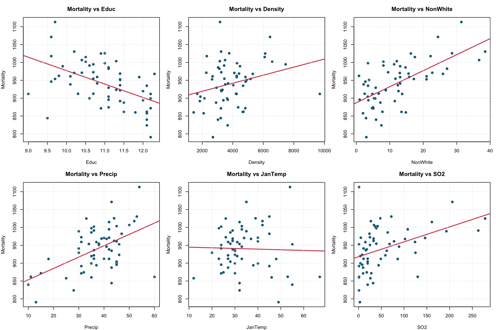

# Environmental and Mortality Modelling

## Overview

This project analyses a 60-city dataset containing mortality, climate, socioeconomic and air-pollution variables. It demonstrates exploratory analysis, exhaustive subset selection, multiple regression, model diagnostics and simulation-based causal reasoning.

## Questions Explored

1. Which climate and socioeconomic variables are most useful for explaining differences in mortality?
2. Do pollution measurements add explanatory power after accounting for other variables?
3. Why can a model with better predictive fit still be unsuitable for estimating a causal effect?

## Methods

- Exploratory visualisation across key predictors
- Exhaustive subset selection using BIC, adjusted R-squared and Mallows' Cp
- Multiple linear regression and interpretation
- Residual, normality and leverage diagnostics
- Nested-model ANOVA
- 500-replicate simulation comparing bias and RMSE across causal model specifications

## Key Results

- The selected six-predictor model achieved an adjusted R-squared of approximately **0.676**.
- Adding log-transformed pollution measures significantly improved model fit in the nested-model comparison.
- In the causal simulation, adjusting for the confounder while excluding the collider produced the lowest bias and RMSE.
- The simulation illustrates that strong predictive fit does not automatically imply valid causal estimation.



## Repository Structure

```text
environmental-mortality-modelling/
├── analysis.R
├── data/
│   └── pollution.csv
└── outputs/
    ├── anova_comparison.txt
    ├── causal_simulation_results.csv
    ├── key_relationships.png
    ├── model_diagnostics.png
    ├── mortality_model_summary.txt
    └── selected_models.csv
```

## Run the Analysis

From this project directory, run:

```bash
Rscript analysis.R
```

The script uses base R only and recreates all files in `outputs/`.

## Limitations and Responsible Interpretation

The dataset is observational, so the regression coefficients should be interpreted as conditional associations rather than causal effects. Several variables describe sensitive demographic and socioeconomic characteristics; results should be communicated carefully and should not be used to stereotype individuals or communities.

## Attribution

Adapted from collaborative STAT2401 coursework completed by Minh Hung Le and Do Tri Cuong. This portfolio version removes assignment prompts and personal identifiers and uses a self-contained model-selection implementation instead of publishing course-provided helper code.
