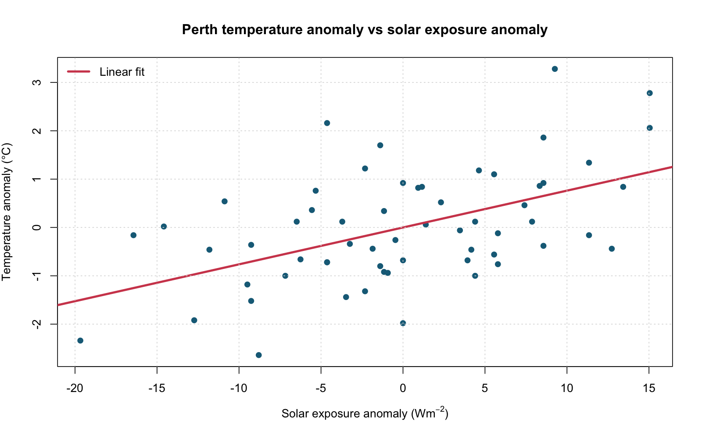

# Perth Climate Analysis and Statistical Simulation

## Overview

This project uses R to investigate the relationship between monthly solar exposure anomalies and temperature anomalies in metropolitan Perth. It also uses Monte Carlo simulation to examine how sample size and true correlation affect the power of a one-sided correlation test.

## Questions Explored

1. Is higher-than-average solar exposure associated with higher-than-average temperature?
2. How much variation in temperature anomaly is explained by solar exposure anomaly alone?
3. How does increasing sample size affect Type I error and statistical power?

## Methods

- Exploratory scatterplots and time-series visualisation
- Simple linear regression
- One-sided hypothesis testing for a positive slope
- 99% confidence interval for the slope
- 10,000-replicate Monte Carlo simulations under different correlations and sample sizes

## Key Results

- The fitted slope was approximately **0.0763**, indicating a positive association between solar exposure and temperature anomalies.
- The model explained approximately **26.3%** of the variation in temperature anomaly.
- The positive slope was statistically significant, while substantial variation remained unexplained by this single-predictor model.
- For a true correlation of 0.5, estimated test power increased from approximately **22% at n=5** to almost **100% at n=100**.



## Repository Structure

```text
perth-climate-analysis/
├── analysis.R
├── data/
│   └── perth-metro-monthly.csv
└── outputs/
    ├── climate_model_summary.txt
    ├── climate_scatter_regression.png
    ├── climate_time_series.png
    └── simulation_results.csv
```

## Run the Analysis

From this project directory, run:

```bash
Rscript analysis.R
```

The script uses base R only and recreates all files in `outputs/`.

## Limitations

This is an observational analysis and does not establish causation. Solar exposure is only one of many factors affecting temperature, and the monthly observations may also contain time dependence that is not modelled here.

## Attribution

Adapted from collaborative STAT2401 coursework completed by Minh Hung Le and Do Tri Cuong. This portfolio version removes assignment prompts and personal identifiers and reorganises the work around a standalone analytical question.
